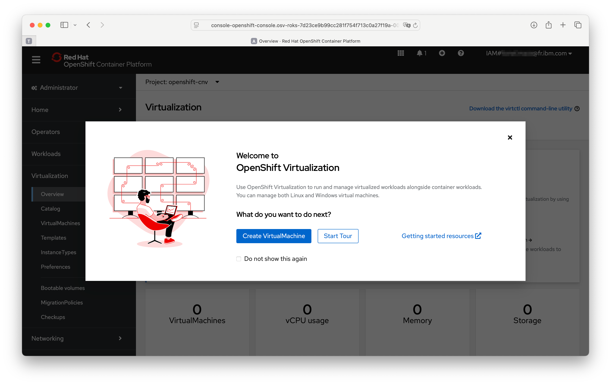
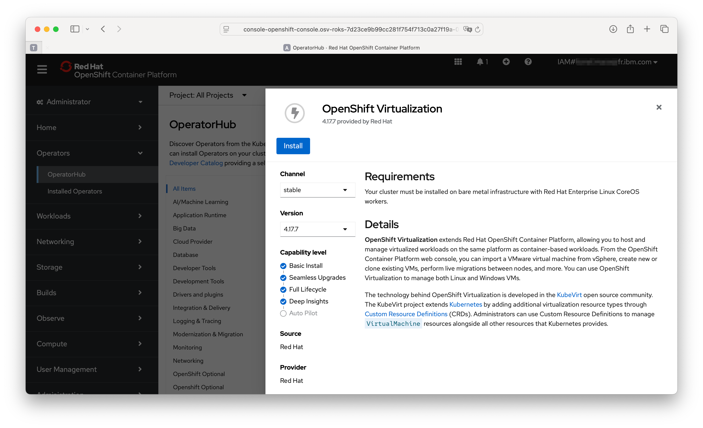
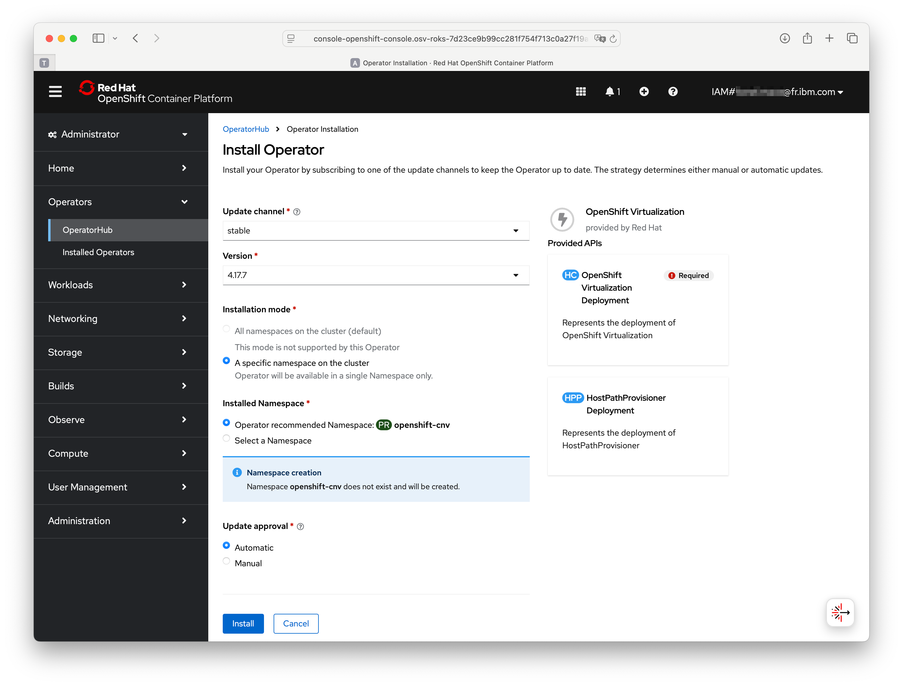
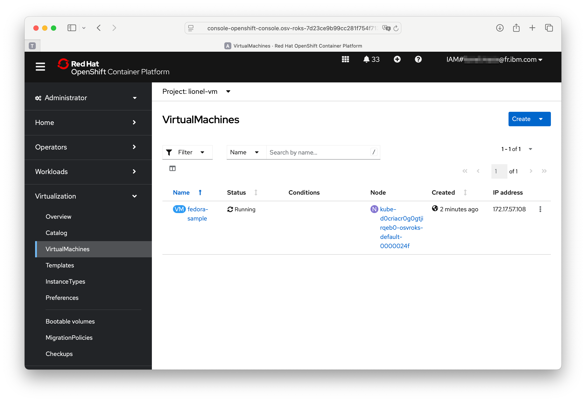

# Terraform scripts to install ROKS with Bare metal workers

Let's deploy a stateless VM with a ContainerDisk, which is ephemeral storage. Thus, the VM will not have any Persistent Volumes (PVs). The basic steps here would be to create a container image and use it as the root disk for the Virtual Machine. The OpenShift's internal registry is used to store the container image.



## Pre-Requisites

    * terraform
    * docker or podman
    * virtctl
    * OC command line

## Provision the cluster via Terraform

> Estimated duration: 1 hour

The Terraform scripts will provision a 4.17 ROKS clusters with two Bare metal worker nodes in the region Toronto.

1. Provision the required infrastructure using the Terraform scripts

    ```sh
    cd terraform
    terraform init
    terraform apply
    ```

## Install the OpenShift Virtualization Operator

1. Install the operator from the OperatorHub

    

    

    

## Connect to the cluster

1. Connect to the cluster

    ```sh
    oc login --token=<ton_token> --server=https://<url_de_ton_cluster>
    ```

1. Create a new project

    ```sh
    DEPLOY_NAMESPACE=vm-project

    oc new-project $DEPLOY_NAMESPACE
    oc project $DEPLOY_NAMESPACE
    ```

1. Expose the Openshift Internal Image Registry

    ```sh
    oc patch configs.imageregistry.operator.openshift.io/cluster --patch '{"spec":{"defaultRoute":true}}' --type=merge
    oc get routes -n openshift-image-registry
    OPENSHIFT_REGISTRY=$(oc get routes -n openshift-image-registry | grep default-route-openshift-image-registry | awk '{print $2}')
    ```

1. Login to the OpenShift Registry

    ```sh
    podman login -u kubeadmin -p `oc whoami -t` $OPENSHIFT_REGISTRY
    ````

## Import Image to the Registry

1. Download image

    ```sh
    curl -LO https://download.fedoraproject.org/pub/fedora/linux/releases/42/Cloud/x86_64/images/Fedora-Cloud-Base-Generic-42-1.1.x86_64.qcow2
    ```

1. Create Dockerfile

    ```sh
    cat << END > Dockerfile
    FROM kubevirt/container-disk-v1alpha
    ADD Fedora-Cloud-Base-Generic-42-1.1.x86_64.qcow2 /disk
    END
    ```

1. Build the image

    ```sh
    podman build -t $OPENSHIFT_REGISTRY/$DEPLOY_NAMESPACE/virt-fedora:32 .
    ```

1. Push the image

    ```sh
    podman push $OPENSHIFT_REGISTRY/$DEPLOY_NAMESPACE/virt-fedora:32
    ```

1. Verify the image is uploaded to the registry under the namespace

    ```sh
    oc get is
    oc describe is virt-fedora
    ```

1. Delete the local image

    ```sh
    rm -rf Fedora-Cloud-Base-32-1.6.x86_64.qcow2 Dockerfile
    ```

## Provision a VM

1. Provision a VM

    ```sh
    cat <<EOF | oc apply -n $DEPLOY_NAMESPACE -f -
    apiVersion: kubevirt.io/v1
    kind: VirtualMachine
    metadata:
      name: fedora-stateless
      labels:
        app: fedora-stateless
    spec:
      running: true
      template:
        spec:
          domain:
            cpu:
              cores: 1
              sockets: 1
              threads: 1
            devices:
              disks:
                - bootOrder: 1
                  disk:
                    bus: virtio
                  name: rootdisk
                - bootOrder: 4
                  disk:
                    bus: virtio
                  name: cloudinitdisk
              interfaces:
                - bootOrder: 2
                  masquerade: {}
                  model: virtio
                  name: nic0
              networkInterfaceMultiqueue: true
              rng: {}
            machine:
              type: pc-q35-rhel8.1.0
            resources:
              requests:
                memory: 2Gi
          evictionStrategy: LiveMigrate
          hostname: fedora-stateless
          networks:
            - name: nic0
              pod: {}
          terminationGracePeriodSeconds: 0
          volumes:
            - containerDisk:
                image: 'image-registry.openshift-image-registry.svc.cluster.local:5000/$DEPLOY_NAMESPACE/virt-fedora:32'
                imagePullPolicy: Always
              name: rootdisk
            - cloudInitNoCloud:
                userData: |
                  #cloud-config
                  ssh_pwauth: True
                  chpasswd:
                    list: |
                      root:password
                    expire: False
                  hostname: fedora-stateless
              name: cloudinitdisk
    EOF
    ```

1. Navigate to Openshift Console → Virtualization → VirtualMachines.

1. Notice the new Virtual Machine been created and in Running state.

    

1. Click on fedora-stateless → VNC Console. Login with credentials as: Username: root Password: password

## Access the Virtual Machine via the cli (oc and virtctl)

1. Switch the context to the deployed namespace

    ```sh
    oc project -n $DEPLOY_NAMESPACE
    ```

1. List the Virtual Machines

    ```sh
    oc get vms
    ```

    Output

    ```sh
    NAME            AGE     VOLUME
    fedora-stateless   9m23s
    ```

1. List the Virtual Machine Instances

    ```sh
    oc get vmis
    ```

    Output

    ```sh
    NAME            AGE   PHASE     IP              NODENAME                                             READY
    fedora-stateless   12m   Running   172.17.57.108   kube-d0criacr0g0gtjirqeb0-osvroks-default-0000024f   True
    ```

1. Access the virtual machine instance via the virtctl cli. Use the credentials as root / password

    ```sh
    virtctl console fedora-stateless
    ```

    Output

    ```sh
    Successfully connected to fedora-stateless console. The escape sequence is ^]

    fedora-stateless login: root
    Password:
    Last login: Tue May 06 16:11:23 on tty1
    [root@fedora-stateless ~]#
    ```

## Clean up the VM and the infrastructure

1. Delete the Virtual Machine

    ```sh
    oc delete vm/fedora-stateless
    ```

1. Delete the infrastructure

    ```sh
    terraform destroy
    ```
